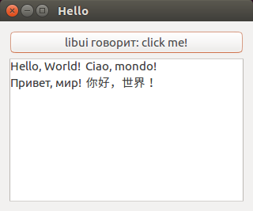

kotlin-libui
============

[Kotlin/Native](https://github.com/JetBrains/kotlin-native) bindings to the
[libui](https://github.com/andlabs/libui.git) C library.

[](https://travis-ci.org/msink/kotlin-libui)
[](https://ci.appveyor.com/project/msink/kotlin-libui)

libui is a C lightweight multi-platform UI library using native widgets on Linux (Gtk3), macOS, and Windows.
Using this bindings you can develop cross-platform but native-looking GUI programs, written in Kotlin,
and compiled to small native executable file.

Cross-platform build is automated using [Travis](https://travis-ci.org) for Linux and macOS targets, and
[AppVeyor](https://ci.appveyor.com) for Windows targets. Just create release on GitHub, and executable files
for all 3 major desktop platforms will be compiled and attached to release.

For local build use `./gradlew build` on Linux or macOS, or `gradlew build` on Windows.
In this case only one - native for your platform - file will be built.

The script below builds kotlin-libui then builds and runs the sample `hello-ktx`:

```
#clone this project
git clone https://github.com/msink/kotlin-libui.git

#build libui.klib
cd kotlin-libui/libui
../gradlew build

#build and run the hello-ktx sample
cd ../samples/hello-ktx/
../../gradlew run
```

## Status

**Warning:** currently it is just a prototype - works in most cases, but not protected from errors.
And as both libui and Kotlin/Native are currently in alpha stage, anything can change.

Well, I'm also not sure about DSL syntax - it works, and for now is good enough.
Let's leave it as is for a while.

If anyone have ideas - Issues and PullRequests are welcome.

## Hello World

Let's start from minimal sample application - single button and single scrollable text area.

<details>
 <summary>Screenshots:</summary>





</details><br/>

<details>
 <summary>C implementation:</summary>
    
``` c
#include "ui.h"

static int onClosing(uiWindow *window, void *data)
{
    uiQuit();
    return 1;
}

static void saySomething(uiButton *button, void *data)
{
    uiMultilineEntryAppend(uiMultilineEntry(data),
        "Hello, World!  Ciao, mondo!\n"
        "Привет, мир!  你好，世界！\n\n");
}

int main(void)
{
    uiInitOptions options;
    uiWindow *window;
    uiBox *box;
    uiButton *button;
    uiMultilineEntry *scroll;

    memset(&options, 0, sizeof(options));
    if (uiInit(&options) != NULL)
        abort();

    window = uiNewWindow("Hello", 320, 240, 0);
    uiWindowSetMargined(window, 1);

    box = uiNewVerticalBox();
    uiBoxSetPadded(box, 1);
    uiWindowSetChild(window, uiControl(box));

    scroll = uiNewMultilineEntry();
    uiMultilineEntrySetReadOnly(scroll, 1);

    button = uiNewButton("libui говорит: click me!");
    uiButtonOnClicked(button, saySomething, scroll);
    uiBoxAppend(box, uiControl(button), 0);

    uiBoxAppend(box, uiControl(scroll), 1);

    uiWindowOnClosing(window, onClosing, NULL);
    uiControlShow(uiControl(window));
    uiMain();
    return 0;
}
```
</details><br/>

<details>
 <summary>Direct translation to Kotlin:</summary>
    
``` kt
import kotlinx.cinterop.*
import libui.*

fun main(args: Array<String>) = memScoped {
    val options = alloc<uiInitOptions>()
    val error = uiInit(options.ptr)
    if (error != null) throw Error("Error: '${error.toKString()}'")

    val window = uiNewWindow("Hello", 320, 240, 0)
    uiWindowSetMargined(window, 1)

    val box = uiNewVerticalBox()
    uiBoxSetPadded(box, 1)
    uiWindowSetChild(window, box?.reinterpret())

    val scroll = uiNewMultilineEntry()
    uiMultilineEntrySetReadOnly(scroll, 1)
    val button = uiNewButton("libui говорит: click me!")
    fun saySomething(button: CPointer<uiButton>?, data: COpaquePointer?) {
        uiMultilineEntryAppend(data?.reinterpret(),
            "Hello, World!  Ciao, mondo!\n" +
            "Привет, мир!  你好，世界！\n\n")
    }
    uiButtonOnClicked(button, staticCFunction(::saySomething), scroll)
    uiBoxAppend(box, button?.reinterpret(), 0)
    uiBoxAppend(box, scroll?.reinterpret(), 1)

    fun onClosing(window: CPointer<uiWindow>?, data: COpaquePointer?): Int {
        uiQuit()
        return 1
    }
    uiWindowOnClosing(window, staticCFunction(::onClosing), null)
    uiControlShow(window?.reinterpret())
    uiMain()
    uiUninit()
}
```
</details><br/>

While this works, it's far from idiomatic Kotlin.

OK, let's wrap all that noisy function calls, with final goal to get something similar to [TornadoFX](https://github.com/edvin/tornadofx):

``` kt
import libui.*

fun main(args: Array<String>) = appWindow(
    title = "Hello",
    width = 320,
    height = 240
) {
    vbox {
        lateinit var scroll: TextArea

        button("libui говорит: click me!") {
            action {
                scroll.append("""
                    |Hello, World!  Ciao, mondo!
                    |Привет, мир!  你好，世界！
                    |
                    |""".trimMargin())
            }
        }
        scroll = textarea {
            readonly = true
            stretchy = true
        }
    }
}
```

## More samples

- [simple form](samples/form)
- [controls gallery](samples/controlgallery)
- [histogram](samples/histogram)
- [drawtext](samples/drawtext)
- [datetime](samples/datetime)
- [timer](samples/timer)
- [logo](samples/logo)
- [table](samples/table)

## Documentation

See [autogenerated documentation](docs/index.md), samples and comments in source code.

### Lifecycle management

Kotlin memory management differs from native C model, so all libui objects are wrapped in Kotlin objects
inherited from [Disposable](docs/libui.ktx/-disposable/index.md), and direct using of libui functions is
not recommended in most cases.

Disposable objects must be disposed by calling [dispose](docs/libui.ktx/-disposable/dispose.md)() method,
before program ends. Most objects are attached as a child to some other object, in this case parent is
responsible to dispose all its children, recursively. As DSL builders automatically add created object to
some container - in most cases you do not have to worry about lifecycle management. But if you want to do
something not supported by DSL builders - you can create Disposable object directly, and in this case
*you* are responsible to dispose or attach it at some point.
